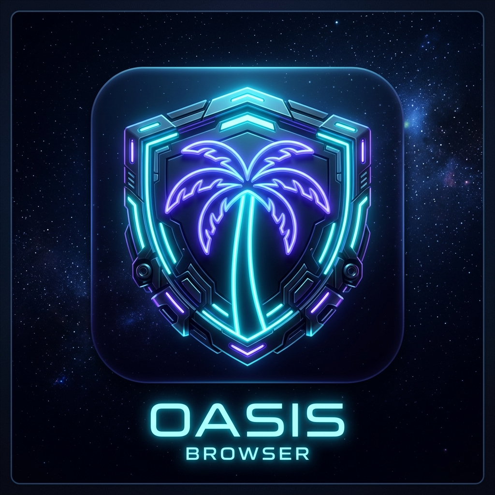

# 🏝️ OASIS Browser Enterprise Platform

> **Production-Grade Multi-Account Anti-Detect Browser Platform featuring Server-Authoritative Architecture, Real-Time WebSocket Synchronization & Single-Admin Security Model.**



[](https://www.electronjs.org/)
[](https://www.postgresql.org/)
[](https://socket.io/)
[](https://pptr.dev/)
[](https://www.docker.com/)
[](https://github.com/Messer1337/AccBrowser)

---

## 📐 Архітектура системи (System Architecture)

OASIS Browser побудовано за **серверно-авторитарною архітектурою**. Всі критичні дані (користувачі, ролі, профілі, сесійні кукі, лізинг та журнал аудіту) зберігаються у захищеній хмарній базі даних **PostgreSQL** на вашому самостійно розгорнутому сервері.

Клієнтський додаток (Electron) працює як безпечне середовище виконання ("executor"), що взаємодіє з сервером через REST API та WebSockets.

```
┌─────────────────────────────────────────────────────────┐
│              OASIS Browser Client (Electron)            │
│  - Chromium Execution Engine (Puppeteer Extra)          │
│  - Live Cookie Injector & WebRTC Leak Shield            │
└────────────┬─────────────────────────────▲──────────────┘
             │ HTTP / REST                 │ WebSockets
             ▼                             │ (Socket.IO)
┌──────────────────────────────────────────┴──────────────┐
│             Self-Hosted Server (Express + Caddy)        │
│  - Single-Admin Security Guard                          │
│  - Preflight Proxy Health Checker                       │
│  - Multi-Device Concurrent Lease Manager                │
└────────────┬────────────────────────────────────────────┘
             │ SQL Queries
             ▼
┌─────────────────────────────────────────────────────────┐
│             PostgreSQL 16 Enterprise Database           │
└─────────────────────────────────────────────────────────┘
```

---

## ✨ Основні Функціональні Можливості (Key Features)

### 👑 1. Жорсткий захист Єдиного Адміністратора (Single-Admin Lock)
- **Унікальність Адміна**: В БД існує фізично лише **1 Адміністратор** (створюється при ініціалізації сервера).
- **Захист від підробки ролей**: Будь-які спроби створити другого адміна (`role: 'admin'`), змінити роль існуючого адміна чи видалити його блокуються сервером (`400 Bad Request`).
- **Співробітники (`role: 'user'`)**: Створюються Адміністратором і бачать тільки призначені їм профілі (`allowedProfiles`).

### ⚡ 2. Паралельна робота з 1 профілю & Live Cookie Sync
- **Одночасний запуск з різних ПК**: Декілька співробітників можуть **одночасно працювати з одного й того ж профілю**.
- **Єдиний проксі та відбиток**: Усі пристрої підключаються через **один і той же проксі-сервер** з однаковими цифровими відбитками (User-Agent, мова, часовий пояс). Джерело трафіку для сайтів виглядає як 1 зовнішній IP.
- **Впорскування кукі у реальному часі**: Нові кукі синхронізуються через WebSockets та **впорскуються (live-inject) у відкриті вкладки Chrome** на інших пристроях без перезапуску браузера.

### 📲 3. Ротація мобільних проксі в 1 клік (Mobile Proxy IP Rotation)
- **Change IP Link**: Можливість задати для профілю посилання для примусової ротації IP (`proxyRotateUrl`).
- **Кнопка "🔄 Ротація IP"**: Натискання надсилає HTTP-запит до мобільного проксі-провайдера, перевіряє новий IP через `PreflightChecker` і виводить актуальну геолокацію та IP на картці.

### 🛡️ 4. Обов'язкова перевірка проксі & WebRTC Shielding
- **Preflight Live Proxy Ping**: Перед запуском Chrome виконується обов'язкова перевірка доступності проксі. Якщо проксі недоступний — **Chrome НЕ відкривається**, унеможливлюючи витік вашої реальної IP-адреси.
- **Захист від WebRTC-витоків**: Прапори `--force-webrtc-ip-handling-policy=disable_non_proxied_udp` унеможливлюють витік локального/зовнішнього IP.
- **Auto-Timezone Alignment**: Автоматичне узгодження часового поясу браузера з реальним IP проксі.

### 🎨 5. Преміальний UI з підтримкою тем (Multi-Theme UI)
- **4 неонові теми**: Oasis Cyber (Neon Indigo), Emerald (Tropical Cyan), Sunset (Rose Gold), Midnight (OLED Dark).
- **Glassmorphism Design**: Backdrop blur, гладкі анімації, індикатори стану профілю та Trust Score.

---

## 🛡️ Модель безпеки та Red-Teaming (Security & Hardening)

* **Scrypt Password Hashing**: Збереження паролів із 16-байтовою випадковою сілью та timing-safe перевіркою.
* **Dynamic Request Authentication**: JWT токени діють 24 години, а права користувача та роль перевіряються в БД при кожному окремому HTTP/WebSocket запиті.
* **Rate Limiting**: Маршрут входу захищено суворим обмеженням (макс. 15 спроб на 15 хвилин).
* **Payload Caps**: Cookies обмежено 700 KB, відбиток — 50 KB, тіло запиту — 5 MB.

---

## 🛠 Технологічний стек (Tech Stack)

| Компонент | Технології |
| :--- | :--- |
| **Backend** | Node.js 22, Express, PostgreSQL 16, Socket.IO, node-pg-migrate, Caddy |
| **Client App** | Electron 43, JavaScript (ES6+), Puppeteer-core |
| **Fingerprinting** | fingerprint-generator, fingerprint-injector, Stealth Plugins |
| **Security** | Scrypt, JWT, Timing-Safe Equality, Express Rate Limit, Helmet |
| **DevOps** | Docker Compose, Caddy Reverse Proxy, Automated Postgres Backup (`pg_dump`) |

---

## 🚀 Швидкий старт (Quick Start & Deployment)

### 1. Розгортання Self-Hosted Сервера (Docker Compose)

Створіть файл `.env` на вашому VPS:
```env
POSTGRES_DB=oasis
POSTGRES_USER=oasis
POSTGRES_PASSWORD=SuperSecretDbPassword123!
JWT_SECRET=SuperSecretJwtKeyMinimum64HexCharactersLongHereForProductionUse!
ADMIN_USERNAME=admin
ADMIN_PASSWORD=AdminInitialPassword123!
OASIS_DOMAIN=your-domain.com
```

Запустіть контейнери:
```bash
docker compose up -d --build
```

### 2. Запуск клієнтського додатка (Electron Client)

```bash
git clone https://github.com/Messer1337/AccBrowser.git
cd AccBrowser
npm install
./start-selfhosted.sh
```

---

## 📦 Збірка Інсталяторів (Build & Packaging)

Збірка готових інсталяторів для macOS (`.zip`) та Windows (`.exe`):
```bash
npm run build
```
*Згенеровані інсталятори розміщуються у папці `dist/`.*

---

## 📜 Ліцензія

Приватна розробка для внутрішнього використання команди. Всі права захищено © 2026 **OASIS Browser Team**.
